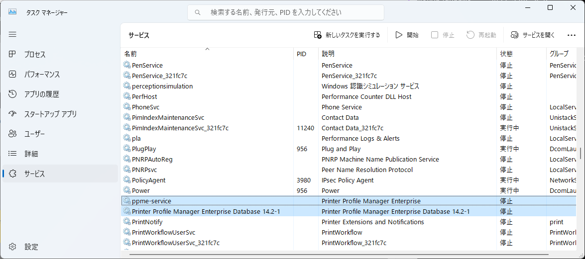

# PPMEのデータバックアップ、リストアガイド

PPME登録のPrinter List/ Profile / Tags などのデータをバックアップ・リストアするためのガイド。

 

## ■ PPME 3.4のバックアップ

 

###  サービスの停止

***[重要] サービス停止中はPPMEの利用は不可。運用に影響がないタイミングで実施すること。***

1. タスクマネージャを起動する。
1. 下記サービスを停止する。

    - ppme-service
    - Printer Profile Manager Enterprise Database...

    

 

###  バックアップ準備

1. コマンドプロンプトを“管理者として実行”で起動する。

1. 下記コマンドを実行する。

        takeown /R /D Y /F "C:\ProgramData\Zebra Technologies\Printer Profile Manager Enterprise"

     

        icacls "C:\ProgramData\Zebra Technologies\Printer Profile Manager Enterprise" /grant:r %username%:(OI)(CI)F /T

     

        icacls "C:\ProgramData\Zebra Technologies\Printer Profile Manager Enterprise\postgresql\14.2-1\data" /grant:r SYSTEM:(OI)(CI)F /T

 

###  データのバックアップ

1. 下記フォルダを任意のフォルダーにコピーする。

        “C:\ProgramData\Zebra Technologies\Printer Profile Manager Enterprise”

     

        “C:\Program Files\Zebra Technologies\Printer Profile Manager Enterprise”

 

###  サービスの起動

1. タスクマネージャを起動する。
1. 下記サービスを起動する。

    - ppme-service
    - Printer Profile Manager Enterprise Database...

    ※ サービス開始後、PPMEが利用可能まで少し時間がかかる。

  

## ■ PPME 3.4のリストア

 

###  サービスの停止

***[重要] サービス停止中はPPMEの利用は不可。運用に影響がないタイミングで実施すること。***

1. タスクマネージャを起動する。
1. 下記サービスを停止する。

    - ppme-service
    - Printer Profile Manager Enterprise Database...

    

 

###  リストア準備

1. コマンドプロンプトを“管理者として実行”で起動する。

1. 下記コマンドを実行する。

        takeown /R /D Y /F "C:\ProgramData\Zebra Technologies\Printer Profile Manager Enterprise"

     

        icacls "C:\ProgramData\Zebra Technologies\Printer Profile Manager Enterprise" /grant:r %username%:(OI)(CI)F /T

     

        icacls "C:\ProgramData\Zebra Technologies\Printer Profile Manager Enterprise\postgresql\14.2-1\data" /grant:r SYSTEM:(OI)(CI)F /T

 

###  データのリストア

1. 予めバックアップしたフォルダを下記フォルダにコピー。

        “C:\ProgramData\Zebra Technologies\Printer Profile Manager Enterprise”

     

        “C:\Program Files\Zebra Technologies\Printer Profile Manager Enterprise”

 

###  サービスの起動

1. タスクマネージャを起動する。
1. 下記サービスを起動する。

    - ppme-service
    - Printer Profile Manager Enterprise Database...

    ※ サービス開始後、PPMEが利用可能まで少し時間がかかる。

1. PPME動作確認とデータ反映確認をする。

